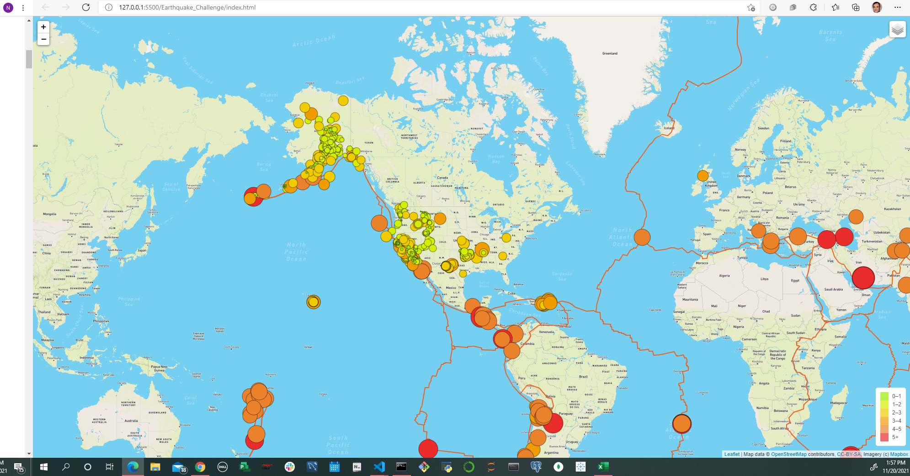

## Project: Mapping Earthquakes

Project Sponsor : CEO Geographical iInstitute

Project Manager: Nayan Patel

Project Scope: Creating the earthquake data in relation to the tectonic plates’ location on the earth, and to see all the earthquakes with a magnitude greater than 4.5 on the map, and the data on a third map.

## Deliverables:
 
Deliverable 1: Add Tectonic Plate Data

Deliverable 2: Add Major Earthquake Data

Deliverable 3: Add an Additional Map

Results: 

